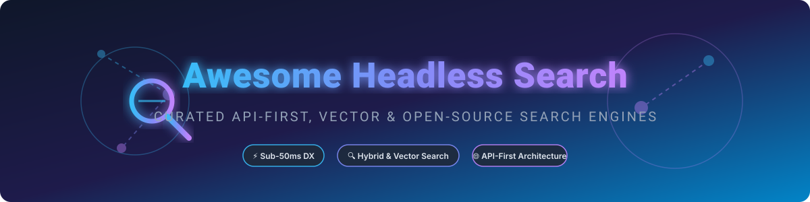

# 🚀 Awesome Headless Search 🔍

**A curated list of leading headless, API-first, vector, and open-source search engines & platforms.**

  
  
  
  
  
  

---

### 🌟 Top Headless Search Platforms & API-First Search Engines

Welcome to the definitive, SEO-optimized guide for selecting **headless search engines**, **open-source search platforms**, **vector databases for semantic search**, and **commercial search-as-a-service APIs**. 

Whether you are building instant search-as-you-type, multi-tenant e-commerce product discovery, faceted search, vector embeddings retrieval, or enterprise hybrid search, this repository aggregates top developer tools and frameworks.

---

## 📋 Table of Contents
- [⚡ Open-Source Search Softwares & Frameworks](#-open-source-search-softwares--frameworks)
- [☁️ SaaS / Hosted Platforms](#%EF%B8%8F-saas--hosted-platforms)
- [💡 Quick Start Recommendations](#-quick-start-recommendations)
- [📈 Star History](#-star-history)
- [🤝 Contributing](#-contributing)

---

## ⚡ Open-Source Search Softwares & Frameworks

Headless search features an exceptionally vibrant open-source ecosystem. The table below lists the top open-source search engines, vector databases, and UI toolkits, **sorted in descending order by GitHub Star count**.

| Project | Stars | Description | License | Key Focus |
|:--------|:-----:|:------------|:--------|:----------|
| **[Elasticsearch](https://github.com/elastic/elasticsearch)** |  | Powerful distributed search and analytics engine built on Apache Lucene. Powers global application search workloads. | Multi-license (AGPL / Elastic License) | Distributed full-text & analytics engine |
| **[Meilisearch](https://github.com/meilisearch/meilisearch)** |  | Lightning-fast, open-source search engine written in Rust. Excellent relevance out of the box with hybrid keyword + semantic search. | MIT (Community Edition) | Ultra-fast DX & instant search |
| **[Milvus](https://github.com/milvus-io/milvus)** |  | Cloud-native vector database built for scalable similarity search and AI-driven semantic retrieval. | Apache 2.0 | High-scale AI vector database |
| **[Qdrant](https://github.com/qdrant/qdrant)** |  | Vector similarity search engine and vector database with extended filtering support written in Rust. | Apache 2.0 | Vector similarity & hybrid search |
| **[Typesense](https://github.com/typesense/typesense)** |  | Open-source, in-memory, typo-tolerant search engine optimized for sub-50ms instant search-as-you-type and vector search. | GPL-3.0 | Instant typo-tolerant developer search |
| **[Sonic](https://github.com/valeriansaliou/sonic)** |  | Fast, lightweight, schema-less search backend written in Rust. Efficient alternative to heavy search indexing stacks. | MPL-2.0 | Minimalist & lightweight search backend |
| **[ZincSearch](https://github.com/zincsearch/zincsearch)** |  | Lightweight, low-resource alternative to Elasticsearch written in Go with built-in full-text search and web UI. | Apache 2.0 | Resource-efficient Go search engine |
| **[Weaviate](https://github.com/weaviate/weaviate)** |  | Open-source vector database allowing users to store data objects and vector embeddings with GraphQL/REST APIs. | BSD 3-Clause | AI vector database & GraphQL APIs |
| **[OpenSearch](https://github.com/opensearch-project/OpenSearch)** |  | Community-driven, open-source fork of Elasticsearch (Apache 2.0). Enterprise distributed search and analytics suite. | Apache 2.0 | Production distributed enterprise search |
| **[Quickwit](https://github.com/quickwit-oss/quickwit)** |  | Cloud-native, sub-second search engine on S3 object storage designed for logs, trace data, and huge datasets. | AGPL-3.0 | Cloud-native / S3-backed log search |
| **[Vespa](https://github.com/vespa-engine/vespa)** |  | High-performance search and AI processing engine by Yahoo. Handles vector search, lexical search, and real-time ML evaluation. | Apache 2.0 | Large-scale AI & vector engine |
| **[Searchkit](https://github.com/searchkit/searchkit)** |  | Headless UI framework and GraphQL API layer for building instant search interfaces on top of Elasticsearch/OpenSearch. | Apache 2.0 | GraphQL & UI layer for Elasticsearch |
| **[Tantivy](https://github.com/quickwit-oss/tantivy)** |  | Full-text search engine library written in Rust (Lucene alternative). Powers Quickwit and custom Rust search tools. | MIT | High-performance Rust search library |
| **[Apache Solr](https://github.com/apache/solr)** |  | Battle-tested, enterprise open-source search platform built on Lucene. Highly scalable with faceted search and hit highlighting. | Apache 2.0 | Scalable enterprise search platform |
| **[Apache Lucene](https://github.com/apache/lucene)** |  | Core ultra-fast, full-featured text search engine library powering Solr, Elasticsearch, OpenSearch, and Nixiesearch. | Apache 2.0 | Foundational indexing & search library |
| **[Nixiesearch](https://github.com/nixiesearch/nixiesearch)** |  | Hybrid search engine for text & vector embeddings based on Lucene and S3-compatible cloud storage. | Apache 2.0 | S3-backed hybrid vector search |

---

## ☁️ SaaS / Hosted Platforms

Commercial, managed search-as-a-service platforms provide zero-ops hosting, advanced merchandising, personalization, and enterprise SLAs. The table below is **sorted in descending order by Company Size (Revenue / Valuation)**.

| Platform | Company Size (Revenue / Valuation) | Description | Key Focus | Starting Pricing | Free Tier / Trial Limits |
|:---------|:-----------------------------------|:------------|:----------|:-----------------|:-------------------------|
| **[Elastic App Search](https://www.elastic.co/)** | **$1.74B Revenue** (Market Cap ~$8B+) | Search-as-a-service layer built on Elasticsearch with relevance controls and APIs. | Enterprise app search | $95/mo (Elastic Cloud Standard tier entry) | 14-day free trial on Elastic Cloud |
| **[Algolia](https://www.algolia.com/)** | **$2.3B Valuation** (~$100M ARR) | Leading API-first search-as-a-service platform with instant search-as-you-type and recommendations. | Hosted search & discovery | $0/mo (Build plan) or $0.50/1k requests (Grow plan) | Free Build plan: 10,000 requests/mo & 50,000 records |
| **[Coveo](https://www.coveo.com/)** | **$148.3M Revenue** (Public TSX: CVO) | Enterprise AI relevance platform for site search, recommendations, and generative experiences. | AI enterprise relevance | $990/mo (Pro plan) / Custom quote | 14-day free trial |
| **[Constructor](https://constructor.io/)** | **~$100M+ Valuation** (Series B $48M) | AI-driven e-commerce product discovery and relevance platform focused on revenue optimization. | E-commerce search & discovery | Custom quote-based pricing | 0-day free trial (Provides 2–4 week Proof POC) |
| **[Searchspring](https://searchspring.com/)** | **~$64M Valuation** (~$25M ARR / Athos Commerce) | E-commerce search and merchandising platform with visual product rules and analytics. | E-commerce search & merchandising | $599/mo (Starter quote plan) | 0-day free trial (Custom interactive product demo) |
| **[Doofinder](https://www.doofinder.com/)** | **~$64.4M Valuation** (~$21.5M ARR) | Smart product search for e-commerce with high accuracy, image search, and quick plugin setup. | E-commerce site search | €49/mo (Basic plan for 10k requests) | 30-day free trial (No credit card required) |
| **[Meilisearch Cloud](https://www.meilisearch.com/)** | **~$30M Valuation** (Venture-backed) | Fully managed cloud hosting for Meilisearch with automatic scaling and zero ops overhead. | Managed hybrid search API | $30/mo (Build plan) | 14-day free trial (Self-hosted is 100% free) |
| **[Klevu](https://www.klevu.com/)** | **~$23.1M Valuation** (~$7.7M ARR / Athos Commerce) | AI self-learning search and discovery engine for e-commerce with rich merchandising tools. | Smart e-commerce search | $199/mo (Starter merchant plan) | 14-day free trial |
| **[Typesense Cloud](https://typesense.org/)** | **~$4.3M Valuation** (~$1.4M ARR) | Fully managed Typesense clusters with global low-latency CDN nodes and zero ops setup. | Managed typo-tolerant search | ~$7.20/mo ($0.01/hr for 0.5GB cluster) | One-time free trial: 720 cluster hours & 10GB bandwidth |
| **[Searchanise](https://searchanise.io/)** | **~$3M+ Valuation** (Bootstrapped / SaaS) | Plug-and-play smart search & filter app popular across Shopify, Magento, and WooCommerce. | Plug-and-play e-commerce search | $19/mo (Standard plan) | Free plan: up to 25 products (Shopify) or 14-day trial |

---

## 💡 Quick Start Recommendations

| Goal | Recommended Starting Option |
|:-----|:----------------------------|
| ⚡ **Fast, easy open-source Algolia alternative** | **Meilisearch** or **Typesense** |
| 🤖 **AI Vector & Semantic Hybrid Search** | **Milvus**, **Qdrant**, or **Weaviate** |
| 🏢 **Production distributed search at scale** | **Elasticsearch** or **OpenSearch** |
| 📊 **Cloud-Native Log & Large-Scale Indexing** | **Quickwit** |
| 🪶 **Minimalist / low-resource search engine** | **ZincSearch** or **Sonic** |
| 🛠️ **Custom Rust Search Engine Development** | **Tantivy** |
| 🏛️ **Battle-tested enterprise search platform** | **Apache Solr** |
| ☁️ **Fully managed API-first commercial search** | **Algolia** |
| 💼 **Enterprise AI relevance & customer service** | **Coveo** |
| 🛍️ **E-commerce merchandising & product discovery** | **Searchspring**, **Constructor**, **Doofinder**, **Klevu**, or **Searchanise** |

---

## 📈 Star History

<a href="https://www.star-history.com/?repos=ishandutta2007%2FAwesome-Headless-Search&type=date&legend=bottom-right">
<picture>
<source media="(prefers-color-scheme: dark)" srcset="https://api.star-history.com/chart?repos=ishandutta2007/Awesome-Headless-Search&type=date&theme=dark&legend=bottom-right" />
<source media="(prefers-color-scheme: light)" srcset="https://api.star-history.com/chart?repos=ishandutta2007/Awesome-Headless-Search&type=date&legend=bottom-right" />

</picture>
</a>

---

## 🤝 Contributing

Contributions, corrections, and additions of new open-source projects or search engines are always welcome! 

Please read our contributing guidelines and submit a Pull Request or issue.

---

**[Awesome-Awesome-Awesome](https://github.com/ishandutta2007/Awesome-Awesome-Awesome)** • Maintained by **[@ishandutta2007](https://github.com/ishandutta2007)**

